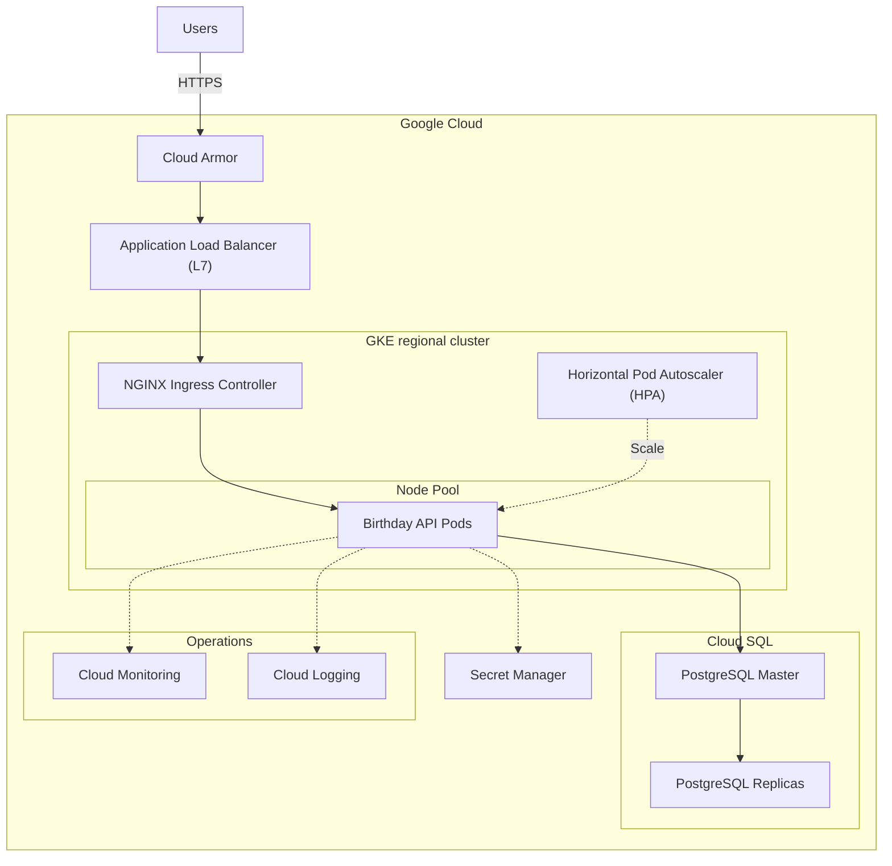

# Birthday API

The Birthday API is a RESTful service designed to manage birthday information efficiently. It enables users to store their birth dates and retrieve personalized birthday messages.

## Table of contents

- [API endpoints](#api-endpoints)
- [Code architecture](#code-architecture)
  - [Domain-Driven Design](#domain-driven-design-ddd)
  - [Hexagonal architecture](#hexagonal-architecture)
  - [Test-Driven Development](#test-driven-development-tdd)
- [System architecture](#system-architecture)
- [Usage](#usage)
  - [Local deployment](#local-deployment)

## API endpoints

The Birthday API provides two main endpoints:

1.  **Save user's birthday**:

    - **Method**: `PUT`
    - **Path**: `/hello/:username`
    - **Description**: Saves or updates a user's date of birth.
    - **URL parameters**:
      - `username`: The username of the user (must be alphabetic characters only)
    - **Request body**:
      ```json
      {
          "dateOfBirth": "YYYY-MM-DD"
      }
      ```
    - **Responses**:
      - `204 No Content`: On success
      - `400 Bad Request`: On validation error

2.  **Get user's birthday**:

    - **Method**: `GET`
    - **Path**: `/hello/:username`
    - **Description**: Retrieves a birthday message for the specified user.
    - **URL Parameters**:
      - `username`: The username of the user (must be alphabetic characters only)
    - **Responses**:
      - 200 OK: On success
        ```json
        {
        "message": "Hello, {username}! Happy birthday!"
        }
        ```
        or
        ```json
        {
        "message": "Hello, {username}! Your birthday is in N day(s)"
        }
        ```
      - `404 Not Found`: If user doesn't exist
      - `400 Bad Request`: On validation error

## Code architecture

The project was designed using Domain-Driven Design (DDD), Hexagonal architecture, and Test-Driven Development (TDD) to create a robust and maintainable codebase.

#### Domain-Driven Design (DDD)

The project is structured around DDD principles to focus on the core problem domain. The domain includes the entity `User` and value objects `Username` and `DateOfBirth`, encapsulating the essential concepts of the system. The `UserService` acts as a domain service, orchestrating operations on these domain objects.

This approach allows for direct handling of the birthday reminder system's complexity and provides a clear path for evolving the system as business requirements change.

#### Hexagonal architecture

In addition, an Hexagonal architecture was adopted to separate core domain logic from external concerns like databases and HTTP interfaces:

- The `domain` package contains core business logic, isolated from external dependencies.
- The `application` layer orchestrates use cases using domain objects.
- The `infrastructure` package implements adapters for external systems like databases.
- The `interfaces` package handles incoming HTTP requests.

This separation makes the system more flexible and testable. For example, the PostgreSQL database can be swapped out for another storage solution without affecting core logic, and business logic can be tested in isolation.

#### Test-Driven Development (TDD)

Throughout the development process, TDD principles were followed. For each new feature, a failing test was written first, then the minimum code needed to pass the test, followed by refactoring.

TDD ensures high test coverage, guides API design, and catches issues early in the development process. Tests also serve as living documentation of system behavior.

## System architecture

The diagram below outlines the architecture of the Birthday API application deployed on Google Cloud:



The system architecture is built on a microservices model and deployed on GKE. It's designed for scalability, high availability, and security, utilizing Google Cloud's managed services to reduce operational efficiency:

1. Cloud Armor is a WAF that provides defense against volumetric DDoS and web attacks. An Application Load Balancer (L7) then distributes traffic efficiently across the application instances.

2. The application runs in a regional GKE cluster, ensuring high availability across zones. NGINX Ingress Controller handles in-cluster routing, while HPA dynamically adjusts pod count based on demand.

3. Cloud SQL for PostgreSQL manages data storage, using read replicas for improved performance and failover. Secret Manager securely stores configuration secrets.

4. Cloud Monitoring and Cloud Logging offer comprehensive visibility into system health and performance.

## Usage

### Local deployment

1.  Ensure [Docker](https://docs.docker.com/get-docker/) and [Docker Compose](https://docs.docker.com/compose/install/) are installed.
2.  Clone the repository:
    ```sh
    git clone https://github.com/keyrm10/birthday-api.git
    ```
3.  Navigate to the project root directory:
    ```sh
    cd birthday-api/
    ```
4.  Build and start the services:
    ```sh
    docker compose up -d
    ```
5.  The API will be accessible at `http://localhost:8080`.

To stop the local deployment:

```sh
docker compose down -v
```

To view logs:

```sh
docker compose logs -f
```
