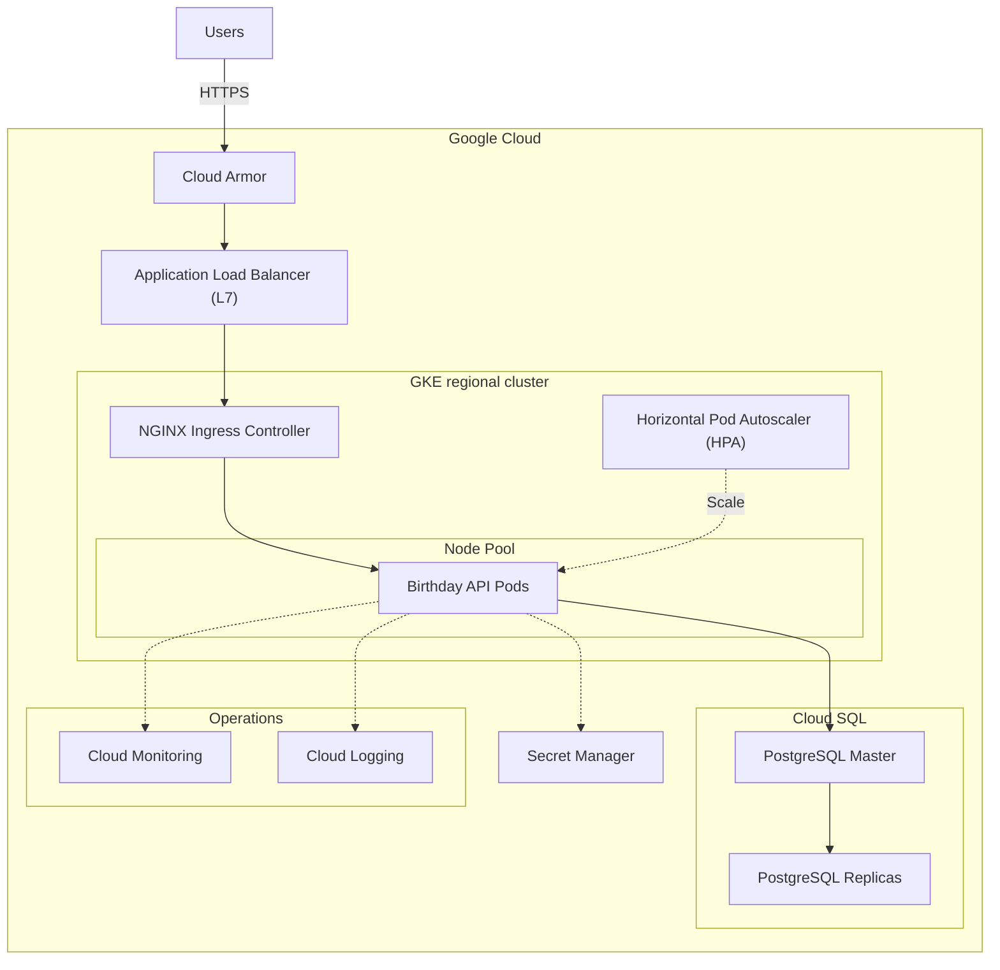

# Birthday API

The Birthday API is a Go-based RESTful service designed to manage birthday information efficiently. It enables users to store their birth dates and retrieve personalized birthday messages.

## Table of contents

- [API endpoints](#api-endpoints)
- [Code architecture](#code-architecture)
  - [Domain-Driven Design](#domain-driven-design-ddd)
  - [Hexagonal architecture](#hexagonal-architecture)
  - [Test-Driven Development](#test-driven-development-tdd)
- [System architecture](#system-architecture)
- [Continuous integration](#continuous-integration)
- [No-downtime deployment](#no-downtime-deployment)
- [Usage](#usage)
  - [Local deployment](#local-deployment)
  - [Cloud deployment](#cloud-deployment)

## API endpoints

The Birthday API provides two main endpoints:

1.  **Save user's birthday**:

    - **Method**: `PUT`
    - **Path**: `/hello/:username`
    - **Description**: Saves or updates a user's date of birth.
    - **URL parameters**:
      - `username`: The username of the user (must be alphabetic characters only)
    - **Request body**:
      ```json
      {
          "dateOfBirth": "YYYY-MM-DD"
      }
      ```
    - **Responses**:
      - `204 No Content`: On success
      - `400 Bad Request`: On validation error

2.  **Get user's birthday**:

    - **Method**: `GET`
    - **Path**: `/hello/:username`
    - **Description**: Retrieves a birthday message for the specified user.
    - **URL Parameters**:
      - `username`: The username of the user (must be alphabetic characters only)
    - **Responses**:
      - `200 OK`: On success
      - `404 Not Found`: If user doesn't exist
      - `400 Bad Request`: On validation error

## Code architecture

The project was designed using Domain-Driven Design (DDD), Hexagonal architecture, and Test-Driven Development (TDD) to create a robust and maintainable codebase.

#### Domain-Driven Design (DDD)

The project is structured around DDD principles to focus on the core problem domain. The domain includes the entity `User` and value objects `Username` and `DateOfBirth`, encapsulating the essential concepts of the system. The `UserService` acts as a domain service, orchestrating operations on these domain objects.

This approach allows for direct handling of the birthday reminder system's complexity and provides a clear path for evolving the system as business requirements change.

#### Hexagonal architecture

In addition, an Hexagonal architecture was adopted to separate core domain logic from external concerns like databases and HTTP interfaces:

- The `domain` package contains core business logic, isolated from external dependencies.
- The `application` layer orchestrates use cases using domain objects.
- The `infrastructure` package implements adapters for external systems like databases.
- The `interfaces` package handles incoming HTTP requests.

This separation makes the system more flexible and testable. For example, the PostgreSQL database can be swapped out for another storage solution without affecting core logic, and business logic can be tested in isolation.

#### Test-Driven Development (TDD)

Throughout the development process, TDD principles were followed. For each new feature, a failing test was written first, then the minimum code needed to pass the test, followed by refactoring.

TDD ensures high test coverage, guides API design, and catches issues early in the development process. Tests also serve as living documentation of system behavior.

## System architecture

The diagram below outlines the architecture of the Birthday API application deployed on Google Cloud:



The system architecture is built on a microservices model and deployed on GKE. It's designed for scalability, high availability, and security, utilizing Google Cloud's managed services to improve operational efficiency:

1. Cloud Armor is a WAF that provides defense against volumetric DDoS and web attacks. An Application Load Balancer (L7) then distributes traffic efficiently across the application instances.

2. The application runs in a regional GKE cluster, ensuring high availability across zones. NGINX Ingress Controller handles in-cluster routing, while HPA dynamically adjusts pod count based on demand.

3. Cloud SQL for PostgreSQL manages data storage, using read replicas for improved performance and failover. Secret Manager securely stores configuration secrets.

4. Cloud Monitoring and Cloud Logging offer comprehensive visibility into system health and performance.

## Continuous integration

The project uses GitHub Actions to streamline and automate the continuous integration process. The following workflows have been included:

- **Test and Lint**: Executes unit tests and linting checks on every push and pull request to the `main` branch.

- **Publish Docker image**: Builds and pushes Docker images to GitHub Container Registry on each push to `main`, ensuring availability of the latest application version.

## No-downtime deployment

Ensuring no-downtime during deployments is critical for a seamless user experience. To achieve this the following strategies are implemented:

1.  **Rolling updates**: The Deployment resource in Kubernetes is configured to use RollingUpdate strategy. This ensures that new pods are gradually rolled out while old pods are terminated, maintaining application availability throughout the update process.
2.  **Readiness probe**: The deployment includes readiness probes to ensure that traffic is only routed to pods that are ready to handle requests. This prevents any downtime during deployments or when pods are starting up.
3.  **Liveness probe**: Liveness probes are implemented to detect and restart unhealthy pods, maintaining system health without manual intervention.
4.  **Multiple replicas**: The deployment maintains multiple replicas of the application to ensure high availability and handle traffic during updates.
5.  **Autoscaling**: Horizontal Pod Autoscaler (HPA) is configured to automatically adjust the number of pods based on CPU utilization, ensuring the application can handle varying loads efficiently.

## Usage

### Local deployment

> [!NOTE]
> This local setup is intended for development and testing purposes only. It uses a local PostgreSQL instance and may not include all the security and scalability features of the cloud deployment.

The local deployment setup uses Docker and Docker Compose to create a self-contained environment for running the Birthday API and its dependencies. This approach allows to quickly set up and test the application on a local machines without the need for complex infrastructure. In order to install it, follow the steps below:

1.  Ensure you have the following tools installed:
    -   [Docker](https://docs.docker.com/get-docker/)
    -   [Docker Compose](https://docs.docker.com/compose/install/)
2.  Clone the repository:
    ```sh
    git clone https://github.com/keyrm10/birthday-api.git
    ```
3.  Navigate to the project root directory:
    ```sh
    cd birthday-api/
    ```
4.  Build and start the services:
    ```sh
    docker compose up -d
    ```
5.  The API will be accessible at `http://localhost:8080`.

To stop the local deployment:
```sh
docker compose down -v
```

To view logs:
```sh
docker compose logs -f
```

### Cloud deployment

The Birthday API is designed to be deployed on Google Cloud using GKE. The deployment process leverages Terraform for infrastructure provisioning and Helm for application deployment. By using Terraform for infrastructure provisioning and Helm for application deployment, we ensure a consistent, repeatable, and version-controlled deployment process across different environments.

This process can be partially automated using the provided [Makefile](./Makefile):

1.  Ensure you have the following tools installed:
    -   [gcloud CLI](https://cloud.google.com/sdk/docs/install)
    -   [Terraform](https://developer.hashicorp.com/terraform/install)
    -   [Helm](https://helm.sh/docs/helm/helm_install/)
2.  Authenticate with Google Cloud:
    ```sh
    gcloud auth login
    gcloud auth application-default login
    gcloud config set project [PROJECT_ID]
    ```
3.  Deploy the infrastructure using Terraform:
    ```sh
    make deploy-infra
    ```
4.  To undeploy the application from GKE:
    ```sh
    make undeploy-app
    ```
5.  To clean up the infrastructure:
    ```sh
    make cleanup
    ```
